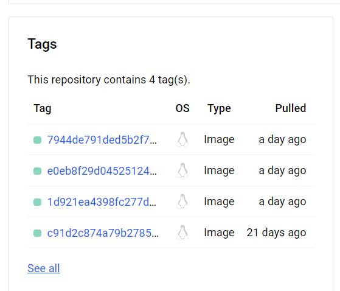
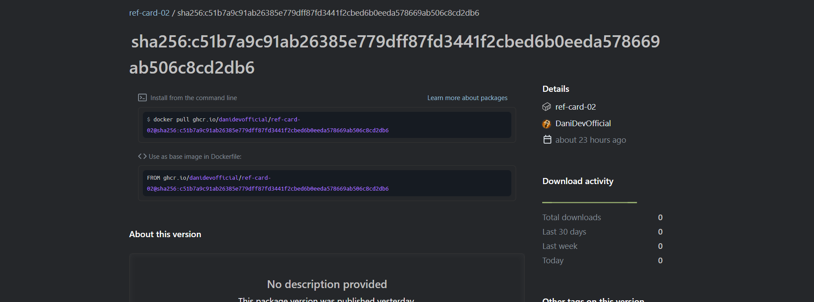
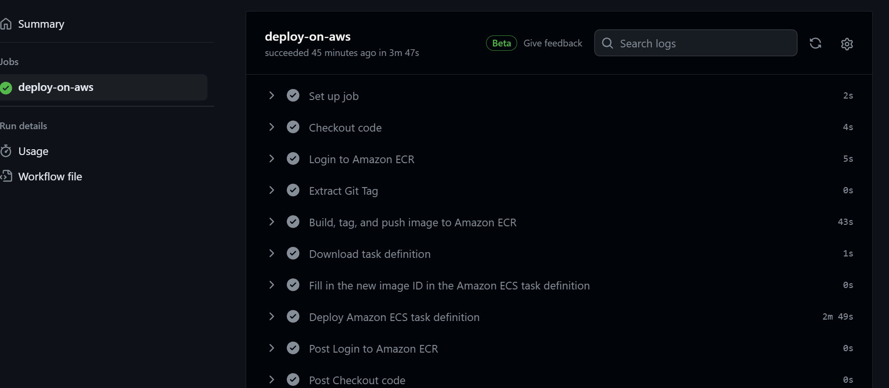

# Docker Images Auf Github und DockerHub pushen


## 1. Einleitung 
Die ist eine kleine Aufgabe, welche wir im Modul M325 erhalten haben. Die Aufgabe bestand darin, ein einfaches React Projekt auf Dockerhub und Github automatisch mit einer GitHub acction zu pushen. Das React Projekt dahinter selbst spielt nicht wirklich eine Rolle.


## 2. Dockerfile

Zuerst muss das React Projekt gebaut werden, um in einem Docker Image zu speichern. Dies wird mit dem Folgendem Dockerfile erreicht:

```dockerfile
FROM node:20-alpine AS build
ENV NODE_ENV development

WORKDIR /app
COPY . .

RUN npm ci
RUN npm run build

FROM nginx:1.21-alpine as prod

COPY --from=build /app/build /usr/share/nginx/html

EXPOSE 80

```
## 3 Remote Push

### 3.1 Auf Docker Hub


Ich habe damit begonnen zu versuchen das Docker Image zuerst auf Docker Hub zu pushen. Dafür musste ich zuerst auf Github selbst im Repository für `secrets.DOCKER_HUB_USERNAME` und `secrets.DOCKER_HUB_PASSWORD` meine Respektiven daten angeben, sodass ich meine Secrets nicht Hardcoden muss. Falls sie selbst das ausprobieren wollen, müssen sie auf Github selbst unter den Repository settings in den Enviroment Variables und darin in den Actions diese beiden Env Secrets angeben und abspeichern. Der folgende Teil vom .yml file ist für das pushen auf Dockerhub nötig:

```yml
jobs:
  publish-docker-image:
    runs-on: ubuntu-latest
    steps:
      - name: Checkout
        uses: actions/checkout@v2

      - name: Login to DockerHub
        uses: docker/login-action@v1
        with:
          username: ${{ secrets.DOCKER_HUB_USERNAME }}
          password: ${{ secrets.DOCKER_HUB_PASSWORD }}

      - name: Publish Docker image to Docker Hub
        uses: docker/build-push-action@v2
        with:
          context: .
          push: true
          tags: ${{ secrets.DOCKER_HUB_USERNAME }}/ref-card-02:${{ github.sha }}
```

Das Resultat auf Dockerhub sollte ungefähr so auf Dockerhub aussehen:



Hier ist das ganze auf [DockerHub](https://hub.docker.com/repository/docker/danithaboss/ref-card-02/general)

### 3.2 Auf Github Packages

Um das Image auf Github selbst zu pushen benötigt man etwas mehr als nur die Login Daten. In meinem yml file wird der username direkt vom Repository genommen, sodass man nicht extra etwas hinzufügen muss. Jedoch wird ein Github acces Token als `secrets.GITHUBTOKEN` gespeichert. Um diesen Zu erhalten muss man auf den eigenen Profileinstellungen einen neuen Token erstellen und zwar mit `write:packages` Rechten, sodass ein Pacakge auch erstellt werden kann. 
`        run: docker tag ${{ secrets.DOCKER_HUB_USERNAME }}/ref-card-02:${{ github.sha }} ghcr.io/danidevofficial/ref-card-02:${{ github.sha }}
`

Hier müsste für personalisierung die Namen etc abgeändert werden. 

Das ganze yml file für GitHub solte ungefär so aussehen:

```yml
      - name: Login to GitHub Container Registry
        uses: docker/login-action@v1
        with:
          registry: ghcr.io
          username: ${{ github.actor }}
          password: ${{ secrets.GITHUBTOKEN }}

      - name: Tag Docker image for GitHub Container Registry
        run: docker tag ${{ secrets.DOCKER_HUB_USERNAME }}/ref-card-02:${{ github.sha }} ghcr.io/danidevofficial/ref-card-02:${{ github.sha }}

      - name: Push Docker image to GitHub Container Registry
        run: docker push ghcr.io/danidevofficial/ref-card-02:${{ github.sha }}
```

Auf Github sollte das unter dem eigenem Account in denn Packages ungefär so aussehen:



[Oder selbst anschauen](https://github.com/users/DaniDevOfficial/packages/container/ref-card-02)


## 4. Auf AWS Hosten

### 4.1 ECR
Um das Docker Image auf AWS zu speichern musste ich zuerst ein ECR erstellen. 

Nachdem ich dies erstellt habe, musste ich zuerst jegliche secrets von AWS angeben, sodass das automatische uploaden mit GH Actions auch funktioniert. 

```yml
      - name: Login to Amazon ECR
        id: login-ecr 
        uses: aws-actions/amazon-ecr-login@v2
        env:
          AWS_ACCESS_KEY_ID: ${{ secrets.AWS_ACCESS_KEY_ID }}
          AWS_SECRET_ACCESS_KEY: ${{ secrets.AWS_SECRET_ACCESS_KEY }}
          AWS_REGION: ${{ secrets.AWS_REGION }}
          AWS_SESSION_TOKEN: ${{ secrets.AWS_SESSION_TOKEN }}

      - name: Extract Git Tag
        id: extract_tag
        run: echo "::set-output name=TAG::$(echo ${GITHUB_REF#refs/tags/})"

      - name: Build, tag, and push image to Amazon ECR
        id: build-image
        env:
          ECR_REGISTRY: ${{ steps.login-ecr.outputs.registry }}
          ECR_REPOSITORY: m324deployment
          IMAGE_TAG: ${{ steps.extract_tag.outputs.TAG }}
        run: |
          # Build a docker container and push it to ECR
          docker build -t $ECR_REGISTRY/$ECR_REPOSITORY:$IMAGE_TAG .
          docker push $ECR_REGISTRY/$ECR_REPOSITORY:$IMAGE_TAG
          echo "::set-output name=image::$ECR_REGISTRY/$ECR_REPOSITORY:$IMAGE_TAG"
          
```

Hierfür habe ich diese Secrets benötigt. Wichtig ist anzumerken, dass manche dieser secrets nach dem neustarten der AWS Konsole erneut gesetzt werden müssen, da sich diese verändern können.

### 4.2 ECS

Ich habe ein ECS Cluster verwenden, um das image vom ECR zu holen und dann zu deployen.

Ich hatte dabei ein wenig mühe bei der Task definition, jedoch habe ich es im endefekt auch hingekrigt. 

Sodass der folgende yml funktioniert musste ich noch einige Variabeln auf Github erstellen. Die sind vergleichbar mit secrets einfach das man sie nach dem erstellen immernoch anschauen kann. 


```yml
      - name: Download task definition
        env:
          AWS_ACCESS_KEY_ID: ${{ secrets.AWS_ACCESS_KEY_ID }}
          AWS_SECRET_ACCESS_KEY: ${{ secrets.AWS_SECRET_ACCESS_KEY }}
          AWS_REGION: ${{ secrets.AWS_REGION }}
          AWS_SESSION_TOKEN: ${{ secrets.AWS_SESSION_TOKEN }}
        run: |
          aws ecs describe-task-definition --region ${{ secrets.AWS_REGION }} --task-definition ${{ vars.MY_ECS_TASK_DEFINITION }} \
          --query taskDefinition > task-definition.json

      - name: Fill in the new image ID in the Amazon ECS task definition
        id: task-def
        uses: aws-actions/amazon-ecs-render-task-definition@v1
        with:
          task-definition: task-definition.json
          container-name: ${{ vars.MY_CONTAINER_NAME   }}
          image: ${{ steps.build-image.outputs.image }}

      - name: Deploy Amazon ECS task definition
        uses: aws-actions/amazon-ecs-deploy-task-definition@v1
        env:
          AWS_ACCESS_KEY_ID: ${{ secrets.AWS_ACCESS_KEY_ID }}
          AWS_SECRET_ACCESS_KEY: ${{ secrets.AWS_SECRET_ACCESS_KEY }}
          AWS_REGION: ${{ secrets.AWS_REGION }}
          AWS_SESSION_TOKEN: ${{ secrets.AWS_SESSION_TOKEN }}
        with:
          task-definition: ${{ steps.task-def.outputs.task-definition }}
          service: ${{ vars.ECS_SERVICE }}
          cluster: ${{ vars.ECS_CLUSTER }}
          wait-for-service-stability: true
```

## 4.3  Deployment

Nach dem all dies gemacht wurde, muss man nur noch die öffentliche url des Load-Balancer nehmen und diese im browser öffnen. Wenn alles richtig gemacht wurde, sollte nun die React app sichtbar sein. Meine befindet sich [hier](http://m324dockerdeploy-2015360705.us-east-1.elb.amazonaws.com/).

## 4.4 Test 

Um zu überprüfen ob das automatische hosting auch funktioniert habe ich etwas ins App.js hinzugefügt und das dann gepusht.
```html
        <a>
          I love la gyato
        </a>
```



Hier ist der Job welcher das ganze erneuert hat (hat funktioniert 😊). 